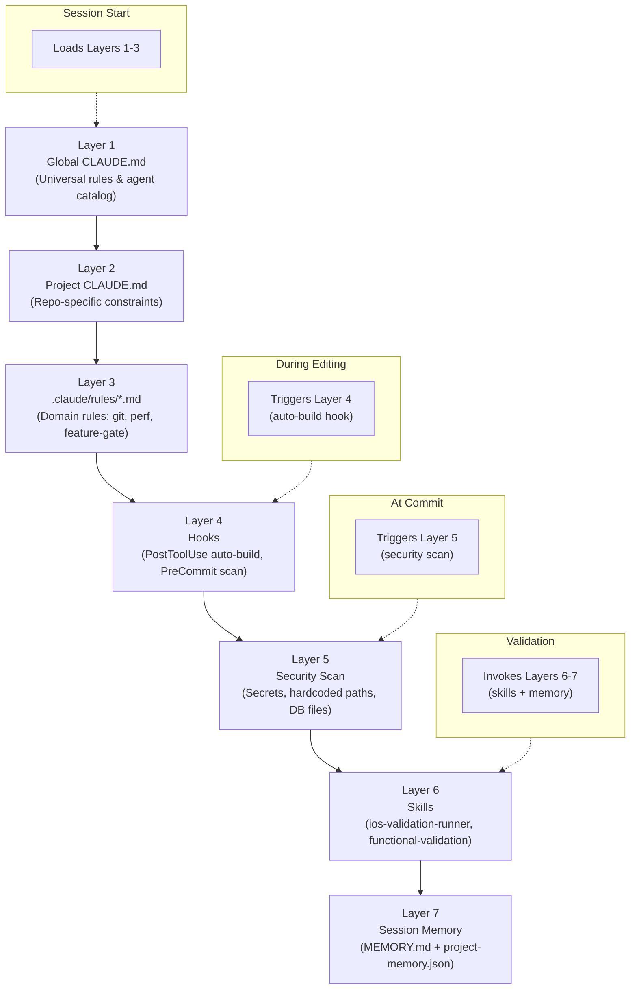

## The 7-Layer Prompt Engineering Stack — Defense-in-Depth for AI Agents

*Agentic Development: 10 Lessons from 8,481 AI Coding Sessions (Post 7 of 11)*

I used to think prompting an AI coding agent was about writing a good initial message. Describe the task clearly, give it some context, hit enter, hope for the best.

After 8,481 sessions I can tell you: the initial prompt is maybe 10% of what determines whether an agent produces reliable code. The other 90% is the invisible system of rules, hooks, skills, and memory that surrounds every interaction — a defense-in-depth architecture where each layer catches failures that slip through the layers above.

I call it the prompt engineering stack. It has 7 layers. Any single layer provides marginal improvement. All 7 together are transformative.

---

### The Problem: AI Agents Cut Corners

Here is the failure mode that cost me the most time across thousands of sessions: an AI agent makes five file edits in rapid succession without verifying any of them compile. By the time you discover the build is broken, the errors have cascaded across three files and the agent's context is polluted with its own mistakes.

Or this one: the agent helpfully commits code that includes a hardcoded API key from an environment variable you pasted during debugging. Now `sk-proj-abc123` is in your git history forever.

Or this: you ask the agent to fix a CSS bug and it decides the real problem is your entire component architecture, refactoring 15 files you did not ask it to touch.

Every one of these failures happened to me. Some of them happened dozens of times before I built the systems to prevent them. The prompt stack is the result of that scar tissue.

---



---

### Layer 1: Global CLAUDE.md — The Constitution

The global CLAUDE.md lives at `~/.claude/CLAUDE.md` and loads for every Claude Code session regardless of project. This is where you encode standards that apply universally — your agent orchestration strategy, model routing preferences, delegation rules.

Think of it as the constitution. Individual projects can add laws, but they cannot override the constitution.

In my setup, the global file defines agent routing:

```markdown
# From ~/.claude/CLAUDE.md (global)
# Model routing:
# - Haiku: quick lookups, lightweight scans, narrow checks
# - Sonnet: standard implementation, debugging, reviews
# - Opus: architecture, deep analysis, complex refactors
```

It also sets the non-negotiable behavioral rules that every session inherits. The most important one, learned after watching agents waste entire sessions writing elaborate test harnesses instead of building the actual feature:

```markdown
# From CLAUDE.md (project-level template)
# claude-prompt-stack/CLAUDE.md

## Functional Validation Mandate

NEVER: write mocks, stubs, test doubles, or fake implementations
when validating features.

ALWAYS: build and run the real system. Validate through actual
user interfaces or real API calls. Capture evidence (screenshots,
logs, curl output) before claiming completion.
```

That single rule — six lines of text — changed the character of every AI session. The agent stops trying to prove correctness through abstraction and starts proving it through demonstration.

---

### Layer 2: Project CLAUDE.md — The Local Law

Each project gets its own CLAUDE.md in the repository root. This file contains project-specific mandates, build commands, common pitfalls, and working style rules.

The working style rules address the behavioral anti-patterns I observed across thousands of sessions:

```markdown
# From CLAUDE.md (project template)
# claude-prompt-stack/CLAUDE.md

## Working Style

### Implement Immediately
When asked to fix or implement something, start with implementation
immediately. Do NOT spend the entire session in planning/discovery
mode reading files repeatedly.

### One Change, One Verify
Make a change. Verify it works. Then make the next change. Do not
batch 5 changes and then discover 3 of them broke the build.

### Stay Focused — No Scope Creep
When fixing a specific bug or build error, stay focused on that issue.
Do NOT escalate into full workspace reorganization, architecture
changes, or broad refactoring unless explicitly asked.
```

These rules emerged from specific, painful sessions. The "Implement Immediately" rule came from watching an agent spend 40 minutes reading every file in a 150-file project before making its first edit. The "No Scope Creep" rule came from asking for a one-line CSS fix and getting back a 15-file component refactor.

---

### Layer 3: Rules Files — Deep Domain Context

The `.claude/rules/` directory contains markdown files that provide deep domain knowledge about specific aspects of the project. Claude Code auto-loads all files in this directory at session start.

The companion repo ships 9 rules files:

```markdown
# From .claude/rules/project.md
# claude-prompt-stack/.claude/rules/project.md

## Tech Stack
- Language: [LANGUAGE_AND_VERSION]
- Framework: [FRAMEWORK_AND_VERSION]
- Build System: [BUILD_TOOL]
- Package Manager: [PACKAGE_MANAGER]

## Key Constants
| Item            | Value           |
|-----------------|-----------------|
| Default Port    | [PORT]          |
| API Prefix      | [API_PREFIX]    |
| Config Path     | [CONFIG_PATH]   |
```

When I fill in these templates for a real project, the agent stops guessing. It knows the port is 9999, not 3000. It knows the API prefix is `/api/v1` and does not double-prefix routes. It knows the build command and does not try `npm run build` on a Swift project.

The `agents.md` rules file defines specialized agent roles and when to invoke them:

```markdown
# From .claude/rules/agents.md
# claude-prompt-stack/.claude/rules/agents.md

## Parallel Task Execution

ALWAYS use parallel agent execution for independent operations:

# GOOD: Parallel execution
Launch 3 agents in parallel:
1. Agent 1: Security analysis of auth module
2. Agent 2: Performance review of data layer
3. Agent 3: Build verification across all targets

# BAD: Sequential when tasks are independent
First agent 1... wait... then agent 2... wait... then agent 3
```

The `development-workflow.md` file encodes the anti-patterns I have seen most frequently:

```markdown
# From .claude/rules/development-workflow.md
# claude-prompt-stack/.claude/rules/development-workflow.md

| Anti-Pattern                  | Do This Instead                  |
|-------------------------------|----------------------------------|
| Planning without executing    | Plan once, then execute          |
| Skipping validation           | Always verify with real system   |
| Batching too many changes     | One change, one verify           |
| Reading files repeatedly      | Read once, track what you know   |
| Scope creep during bug fixes  | Fix the bug, move on             |
```

---

### Layer 4: Auto-Build Hook — The Guardrail That Changed Everything

This is the layer that had the single biggest impact on code quality. The auto-build hook fires automatically after every source file edit and runs the appropriate build command based on file type.

Here is the hook configuration that wires it up:

```json
// From .claude/settings.local.json
// claude-prompt-stack/.claude/settings.local.json

{
  "hooks": {
    "PostToolUse": [
      {
        "matcher": "Edit|Write|MultiEdit",
        "command": "bash .claude/hooks/auto-build-check.sh \"$CLAUDE_FILE_PATH\"",
        "timeout": 120000
      }
    ]
  }
}
```

And here is the routing logic that detects file type and runs the right build:

```bash
# From .claude/hooks/auto-build-check.sh
# claude-prompt-stack/.claude/hooks/auto-build-check.sh

case "$FILE_PATH" in
    # TypeScript / JavaScript
    *.ts|*.tsx|*.js|*.jsx)
        build_typescript || build_result=$?
        ;;
    # Python
    *.py)
        build_python || build_result=$?
        ;;
    # Rust
    *.rs)
        build_rust || build_result=$?
        ;;
    # Go
    *.go)
        build_go || build_result=$?
        ;;
    # Swift
    *.swift)
        build_swift || build_result=$?
        ;;
    # C / C++
    *.c|*.cpp|*.cc|*.h|*.hpp)
        if [ -f "Makefile" ]; then
            make 2>&1 | tail -20 || build_result=$?
        elif [ -f "CMakeLists.txt" ]; then
            cmake --build build 2>&1 | tail -20 || build_result=$?
        fi
        ;;
    # Non-source files: no build needed
    *)
        exit 0
        ;;
esac

if [ $build_result -ne 0 ]; then
    echo ""
    echo "BUILD FAILED: Fix the errors above before continuing."
    exit 1
fi
```

The key insight: when the hook exits with code 1, Claude Code surfaces it as an error that the agent must address before continuing. The agent cannot ignore a failed build. It cannot say "I will fix that later." It must fix it now, on this edit, before making the next one.

This single mechanism eliminated the cascading-build-failure problem that plagued my first thousand sessions.

---

### Layer 5: Pre-Commit Security Hook — The Last Line of Defense

The pre-commit hook scans every staged file for secrets, credentials, and sensitive data before any commit reaches the repository. It runs automatically when the agent executes `git commit`.

The blocking patterns — these reject the commit entirely:

```bash
# From .claude/hooks/pre-commit-check.sh
# claude-prompt-stack/.claude/hooks/pre-commit-check.sh

# OpenAI / Anthropic API keys
if grep -nE 'sk-[a-zA-Z0-9]{20,}' "$file" 2>/dev/null; then
    echo "BLOCKED: Possible API key found in $file"
    BLOCKED=1
fi

# AWS Access Keys
if grep -nE 'AKIA[A-Z0-9]{16}' "$file" 2>/dev/null; then
    echo "BLOCKED: AWS access key found in $file"
    BLOCKED=1
fi

# GitHub tokens
if grep -nE '(ghp_|ghu_|ghs_|gho_|ghr_)[a-zA-Z0-9]{36,}' "$file" 2>/dev/null; then
    echo "BLOCKED: GitHub token found in $file"
    BLOCKED=1
fi

# GitLab tokens
if grep -nE 'glpat-[a-zA-Z0-9\-]{20,}' "$file" 2>/dev/null; then
    echo "BLOCKED: GitLab token found in $file"
    BLOCKED=1
fi

# Private keys
if grep -nE '-----BEGIN (RSA |EC |OPENSSH )?PRIVATE KEY-----' "$file" 2>/dev/null; then
    echo "BLOCKED: Private key found in $file"
    BLOCKED=1
fi
```

It also catches sensitive file types that should never be committed:

```bash
# From .claude/hooks/pre-commit-check.sh
# claude-prompt-stack/.claude/hooks/pre-commit-check.sh

case "$file" in
    *.sqlite|*.sqlite3|*.db)
        echo "BLOCKED: Database file staged for commit: $file"
        BLOCKED=1
        ;;
    .env|.env.*|*.env)
        echo "BLOCKED: Environment file staged for commit: $file"
        BLOCKED=1
        ;;
    *.pem|*.key|*.p12|*.pfx)
        echo "BLOCKED: Certificate/key file staged for commit: $file"
        BLOCKED=1
        ;;
esac
```

And warning patterns that flag suspicious content but allow the commit to proceed:

```bash
# Hardcoded absolute paths
if grep -nE '/Users/[a-zA-Z]|/home/[a-zA-Z]' "$file" 2>/dev/null; then
    echo "WARNING: Hardcoded absolute path in $file"
    WARNED=1
fi

# Hardcoded passwords
if grep -niE '(password|passwd|pwd)\s*=\s*"[^"]+"|password\s*:\s*"[^"]+"' "$file"; then
    echo "WARNING: Possible hardcoded password in $file"
    WARNED=1
fi
```

I have caught real API keys with this hook. During debugging sessions, it is natural to paste credentials into code temporarily. The hook ensures they never reach the repository, even when the agent (or you) forget to clean up.

---

### Layer 6: Skills — Composable Validation Workflows

Skills are markdown files that define reusable validation protocols. They are more than documentation — they are executable workflows that the agent follows step by step.

The `functional-validation` skill enforces evidence-based completion claims:

```markdown
# From skills/functional-validation.md
# claude-prompt-stack/skills/functional-validation.md

## Workflow

### Step 1: Build the Real Application
Verify the build succeeds with zero errors. If it fails, fix the build first.

### Step 2: Start the Application
Wait for the application to be fully ready (health check, UI loaded).

### Step 3: Exercise the Feature
Interact with the feature through its actual interface:
- For web apps: Navigate to the page, click buttons, fill forms
- For APIs: Send real HTTP requests with curl
- For mobile apps: Navigate the real UI in the simulator

### Step 4: Capture Evidence
Collect at least one form of evidence:
- Screenshots, API responses, log output, terminal output

### Step 5: Verify Against Requirements
Compare captured evidence against the original requirements.

## Evidence Standards
| Claim                  | Minimum Evidence                            |
|------------------------|---------------------------------------------|
| "Feature works"        | Screenshot or API response showing it works |
| "Bug is fixed"         | Before/after evidence showing the fix       |
| "No regressions"       | Key existing features still function        |
| "Performance improved" | Measurable metrics (timing, memory, etc.)   |

## Anti-Patterns
- NEVER claim "it should work" without evidence
- NEVER create mock objects to simulate behavior
- NEVER write unit tests as a substitute for functional validation
- NEVER assume the feature works based on reading the code alone
```

The iOS validation runner skill adds platform-specific steps for simulator-based verification:

```markdown
# From skills/ios-validation-runner.md
# claude-prompt-stack/skills/ios-validation-runner.md

### Step 4: Navigate to Feature

Use one of these approaches (in order of reliability):

1. Deep links (if supported):
   xcrun simctl openurl [SIMULATOR_UDID] "[URL_SCHEME]://[ROUTE]"

2. Accessibility tree (most reliable for taps):
   # Get accessibility tree with exact coordinates
   idb_describe operation:all
   # Then tap using coordinates from the tree
   idb_tap [x] [y]

3. Direct state modification (for screenshots only):
   Temporarily modify @State defaults to auto-present the target view.
```

Skills compose hierarchically. A high-level skill orchestrates lower-level skills, each adding specific capabilities. The `functional-validation` skill provides the general framework; the iOS validation runner adds platform-specific mechanics.

---

### Layer 7: Project Memory — Cross-Session Knowledge

MEMORY.md persists knowledge across AI sessions. Every session starts by reading it. Every session can append to it. Over time, it becomes the institutional memory of the project.

The template provides structure:

```markdown
# From MEMORY.md
# claude-prompt-stack/MEMORY.md

## Key Facts
- Project: [PROJECT_NAME]
- Build command: [BUILD_COMMAND]
- Port: [PORT_NUMBER]

## Architecture Decisions
<!-- Record important choices so future sessions don't re-debate them -->

## Known Pitfalls
<!-- Things that have gone wrong before -->

## Lessons Learned
<!-- Insights from debugging sessions, failed approaches -->
```

In my production project, MEMORY.md grew to over 200 lines across hundreds of sessions. It records things like: "The old backend binary at `/Users/nick/ils/ILSBackend/` returns raw data — ALWAYS use the new binary at `/Users/nick/Desktop/ils-ios/`." Or: "Deep link UUIDs must be LOWERCASE — uppercase causes failures." Or: "Always call `process.waitUntilExit()` before accessing `process.terminationStatus`."

Each of those entries represents a debugging session that cost 30–60 minutes. With memory, the agent learns from the first occurrence and never repeats the mistake.

---

### The Compound Effect

Here is why the stack works as a system and not just a collection of tips:

The AI cannot forget the build command (Layer 3 documents it, Layer 4 runs it automatically).

The AI cannot skip validation (Layer 2 mandates it, Layer 6 provides the workflow).

The AI cannot ship broken code (Layer 4 catches it on every single edit).

The AI cannot leak secrets (Layer 5 blocks them at commit time with pattern matching for `sk-*`, `AKIA*`, `ghp_*`, `glpat-*`, and Bearer tokens).

The AI cannot repeat past mistakes (Layer 7 remembers them across sessions).

The setup script makes the investment front-loaded:

```bash
# From setup.sh
# claude-prompt-stack/setup.sh

bash setup.sh --target /path/to/your/project

# Creates:
# Layer 2: CLAUDE.md
# Layer 3: .claude/rules/ (9 files)
# Layer 4: .claude/hooks/auto-build-check.sh
# Layer 5: .claude/hooks/pre-commit-check.sh
# Layer 6: skills/ (2 files)
# Layer 7: MEMORY.md
```

One command. Then customize the templates for your project. The defense-in-depth system is operational from the first session.

---

### What I Would Tell Myself 8,000 Sessions Ago

Start with Layer 4 (auto-build hook). It has the highest impact-to-effort ratio. A 149-line bash script that runs after every edit eliminated more bugs than any other single intervention.

Then add Layer 5 (pre-commit security). Another 149-line script that runs before every commit. It costs nothing and prevents catastrophic mistakes.

Then build out Layers 1–3 (CLAUDE.md and rules). This is where you encode your project's institutional knowledge so the agent stops guessing.

Layers 6 and 7 (skills and memory) grow organically as you work. Do not try to write them all upfront. Let them emerge from real sessions and real failures.

The prompt engineering stack is not about writing better prompts. It is about building a system that makes it structurally impossible for an AI agent to cut corners, skip verification, leak secrets, or repeat past mistakes. Defense in depth. Every layer matters.

---

Companion repo with all templates, hooks, and skills: [krzemienski/claude-prompt-stack](https://github.com/krzemienski/claude-prompt-stack)

`#AgenticDevelopment` `#PromptEngineering` `#ClaudeCode` `#AIAgents` `#DefenseInDepth`

---

*Part 7 of 11 in the [Agentic Development](https://github.com/krzemienski/agentic-development-guide) series.*
